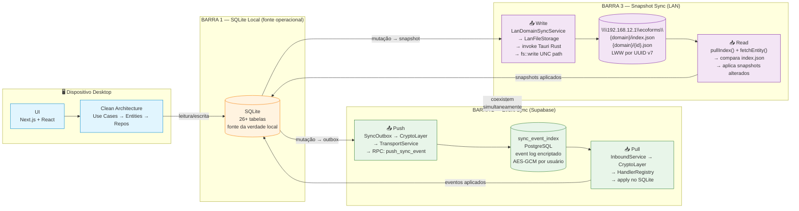
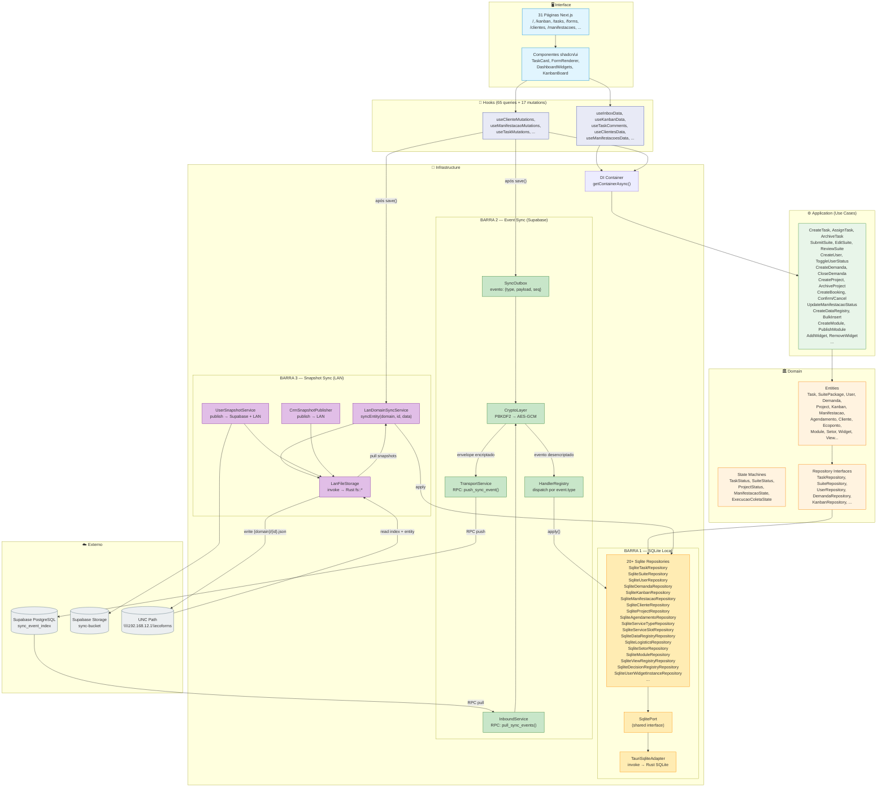
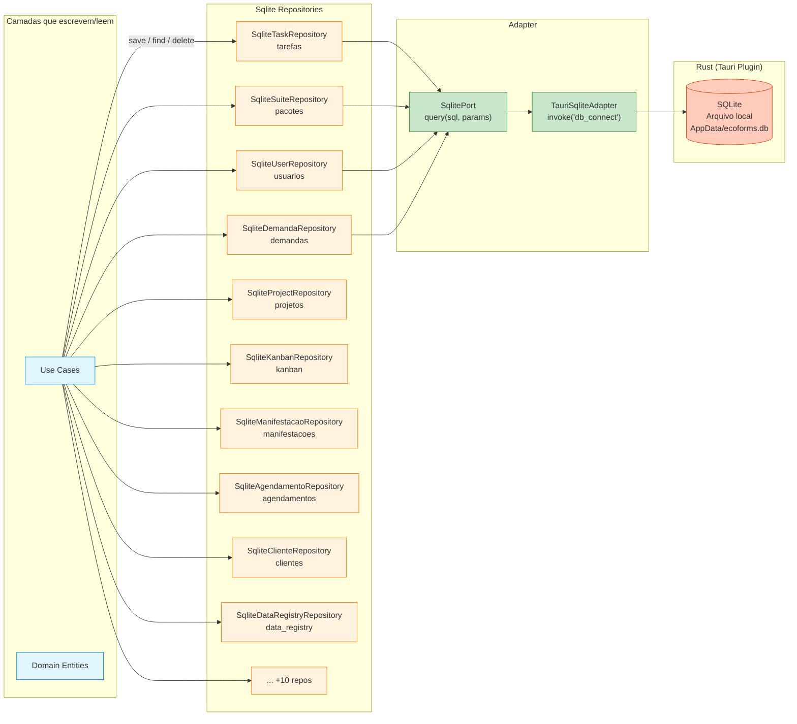
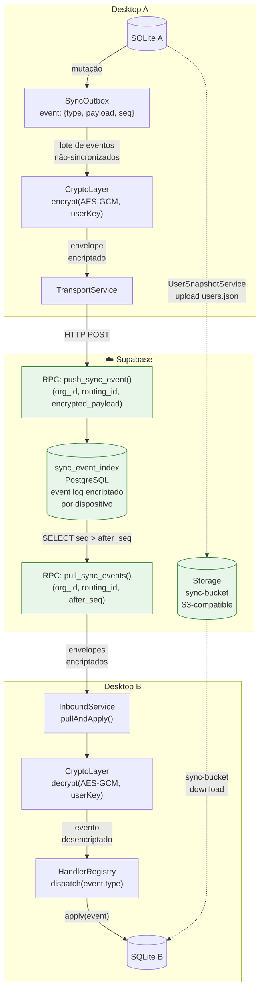
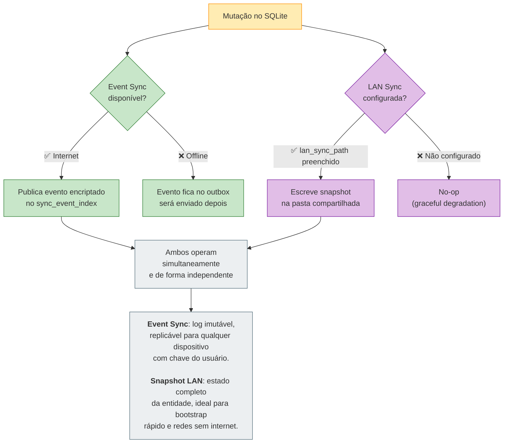
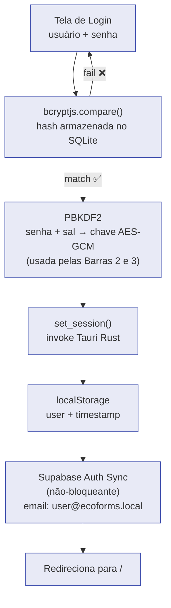

# EcoForms — Arquitetura de Dados: 3 Barramentos

> **Offline-First + Clean Architecture**.
> Toda mutação nasce no SQLite local. A partir dele, dois barramentos de sincronização coexistem:
> um orientado a **eventos** (Supabase) e outro orientado a **snapshots por entidade** (LAN).

---

## Visão Geral: Os 3 Barramentos



| Barramento | Tipo | Resolução | Cobertura | Encriptação |
|---|---|---|---|---|
| **1 — SQLite Local** | Fonte operacional | Imediata (local) | 100% dos dados | bcrypt (senhas) |
| **2 — Event Sync Supabase** | Orientado a eventos | Eventual (push/pull RPC) | Multi-dispositivo (nuvem) | AES-GCM por chave derivada do usuário |
| **3 — Snapshot Sync LAN** | Orientado a snapshots por entidade | LWW por UUID v7 | Multi-dispositivo (rede local) | Nenhuma (rede confiável) |

---

## Clean Architecture + 3 Barramentos



---

## Barra 1: SQLite Local — Fonte Operacional



### Características

| Propriedade | Valor |
|---|---|
| **Motor** | SQLite via Tauri Plugin (Rust) |
| **Acesso** | `SqlitePort` (interface) → `TauriSqliteAdapter` → `invoke('db_connect')` |
| **Tabelas** | 26+ (tarefas, pacotes, usuarios, demandas, projetos, kanban, manifestacoes, agendamentos, clientes, ecopontos, service_types, service_slots, modulos, view_registry, decision_registry, user_widget_instances, setores, tipo_prazos, tipo_residuos, execucao_coletas, execucao_clientes, email_config, hierarquia_perfis, notificacao_solicitantes, data_registry, sync_device_log) |
| **ORM** | Nenhum — SQL raw |
| **Consistência** | Imediata (local) |
| **É a fonte da verdade** | Sim — toda mutação começa aqui |

---

## Barra 2: Event Sync — Supabase (sync_event_index)

> **Orientado a eventos**.
> Cada mutação no SQLite gera um evento no outbox.
> Eventos são encriptados (AES-GCM) e publicados como log imutável no Supabase.
> Outros dispositivos puxam e aplicam na ordem.



### Características

| Propriedade | Valor |
|---|---|
| **Paradigma** | Event Sourcing (log imutável de eventos) |
| **Granularidade** | Evento = uma mutação atômica (create/update/delete) |
| **Ordem** | Sequencial por dispositivo (`seq`) |
| **Encriptação** | AES-GCM com chave derivada do usuário (PBKDF2) |
| **Transporte** | Supabase RPC (`push_sync_event` / `pull_sync_events`) |
| **Armazenamento** | `sync_event_index` (PostgreSQL) |
| **Resolução de conflitos** | Ordem de chegada no event log |
| **Arquivos** | `sync-bucket` (Supabase Storage S3) para users.json, org config |
| **Ciclo** | Push no save, Pull manual/botão/timer |

### Formato do Evento (SyncOutbox)

```ts
{
  id: string,            // UUID v7
  type: string,          // "task.created" | "suite.updated" | "user.deleted" | ...
  aggregate_id: string,  // ID da entidade
  payload: unknown,      // dados da mutação (delta ou full)
  seq: number,           // sequencial local
  synced: 0 | 1,         // flag de enviado
  created_at: string     // ISO timestamp
}
```

---

## Barra 3: Snapshot Sync — LAN (UNC Path)

> **Orientado a snapshots por entidade**.
> Cada mutação publica o estado completo da entidade como arquivo JSON na pasta compartilhada.
> Outros dispositivos leem o `index.json` para detectar mudanças e aplicam os snapshots alterados.

```mermaid
flowchart TD
    subgraph DEV_A["Desktop A"]
        SQL_A2[("SQLite A")]
        LDSS_A["LanDomainSyncService<br/>syncEntity(domain, id, data)"]
        LFS_A["LanFileStorage<br/>invoke → Rust fs::write"]
    end

    subgraph LAN_FS["💾 Pasta Compartilhada (UNC Path)"]
        direction TB
        ROOT["\\\\192.168.12.1\\ecoforms\\"]

        subgraph DOM_USERS["usuarios/"]
            IDX_U["index.json<br/>{ last_entity_uuid, entities: { id: { v, hash, last_event_id } } }"]
            E_U["{id}.json<br/>snapshot completo<br/>(sem hash_senha/sal_sync)"]
        end

        subgraph DOM_TASKS["tarefas/"]
            IDX_T["index.json"]
            E_T["{id}.json"]
        end

        subgraph DOM_CLI["clientes/"]
            IDX_C["index.json"]
            E_C["{id}.json"]
        end
    end

    subgraph DEV_B["Desktop B"]
        SQL_B2[("SQLite B")]
        LDSS_B["LanDomainSyncService<br/>pullIndex() + fetchEntity()"]
        LFS_B["LanFileStorage<br/>invoke → Rust fs::read"]
    end

    SQL_A2 -->|"mutação"| LDSS_A
    LDSS_A -->|"1. SHA-256(payload)<br/>2. hash igual? → skip<br/>3. write {domain}/{id}.json<br/>4. updateIndex(domain,id,v,hash,eventId)"| LFS_A
    LFS_A -->|"fs::write"| E_U
    LFS_A -->|"fs::write"| IDX_U
    LFS_A -->|"fs::write"| E_T
    LFS_A -->|"fs::write"| IDX_T

    IDX_U -->|"fs::read"| LFS_B
    IDX_T -->|"fs::read"| LFS_B
    E_U -->|"fs::read"| LFS_B
    E_T -->|"fs::read"| LFS_B
    LFS_B --> LDSS_B
    LDSS_B -->|"compara index local<br/>aplica snapshots alterados"| SQL_B2

    classDef device fill:#e1f5fe,stroke:#0288d1
    classDef lan fill:#f3e5f5,stroke:#7b1fa2
    classDev_A,SQL_A2,LDSS_A,LFS_A,DEV_B,SQL_B2,LDSS_B,LFS_B device
    class ROOT,DOM_USERS,DOM_TASKS,DOM_CLI,IDX_U,E_U,IDX_T,E_T,IDX_C,E_C lan
```

### Características

| Propriedade | Valor |
|---|---|
| **Paradigma** | Snapshot por entidade (estado completo, não delta) |
| **Granularidade** | Entidade individual = 1 arquivo JSON |
| **Detecção de mudanças** | SHA-256 do payload → skip se hash não mudou |
| **Resolução de conflitos** | **LWW (Last-Write-Wins)** por `last_event_id` (UUID v7) |
| **Versionamento** | Campo `v` incremental por entidade no index.json |
| **Transporte** | Tauri `invoke()` → Rust `fs::read` / `fs::write` sobre UNC path |
| **Codificação** | Base64 (TypeScript ↔ Rust) |
| **Segurança** | `validate_path()` bloqueia `..` (path traversal) |
| **Graceful degradation** | Se `lan_sync_path` vazio → todas operações no-op |
| **Integridade** | `UserSnapshotService` remove `hash_senha` e `sal_sync` antes de publicar |

### Estrutura de Diretórios na Pasta LAN

```
\\192.168.12.1\ecoforms\
├── usuarios/
│   ├── index.json
│   ├── 018f3a2c-...json
│   └── 019a4b5d-...json
├── tarefas/
│   ├── index.json
│   └── 01b5c6e7-...json
├── clientes/
│   ├── index.json
│   └── ...
├── crm/
│   ├── fonte_a.json
│   └── fonte_b.json
└── shared/
    └── users.json          ← snapshot completo (todos usuários)
```

### Formato do index.json

```json
{
  "last_entity_uuid": "019a4b5d-...",
  "entities": {
    "018f3a2c-...": {
      "v": 3,
      "hash": "a1b2c3d4e5f6...",
      "last_event_id": "01b5c6e7-..."
    }
  }
}
```

---

## Coexistência Barra 2 + Barra 3: Quando Usar Cada Um



| Cenário | Barra 2 (Event Sync) | Barra 3 (Snapshot LAN) |
|---|---|---|
| **Dispositivo offline** | Eventos acumulam no outbox | Não disponível (sem rede) |
| **Rede local sem internet** | Indisponível | ✅ Funciona (UNC path) |
| **Internet disponível** | ✅ Sincroniza via Supabase | ✅ Sincroniza via LAN |
| **Novo dispositivo (bootstrap)** | Precisa reproduzir todo event log | ✅ Lê snapshots direto |
| **Auditoria / histórico** | ✅ Log imutável de eventos | ❌ Apenas estado atual |
| **Conflitos** | Ordem de chegada no log | LWW por UUID v7 |
| **Segurança** | AES-GCM (dados encriptados em trânsito e repouso) | Rede confiável (sem encriptação) |

---

## Autenticação



---

## Tabelas e Entidades por Domínio

| Domínio | Entidade | Tabela SQLite (Barra 1) | Use Cases |
|---------|----------|--------------------------|-----------|
| **Task** | Task | `tarefas` | CreateTask, AssignTask, ArchiveTask, MoveTask, TaskMetrics |
| **Kanban** | KanbanBoard | `kanban` | GetKanban, UpdateColumns |
| **Suite** | SuitePackage | `pacotes` | SubmitSuite, EditSuite, ReviewSuite, ListInbox, ResubmitSuite |
| **User** | User | `usuarios` | ListUsers, CreateUser, UpdateUser, ToggleUserStatus |
| **Demanda** | Demanda | `demandas` | CreateDemanda, AcceptDemanda, CloseDemanda, DemandaTaskSynchronizer |
| **Project** | Project | `projetos` | CreateProject, UpdateProject, ArchiveProject, ListProjectsWithMetrics |
| **Service** | Agendamento, ServiceSlot, ServiceType | `agendamentos`, `service_slots`, `service_types` | CreateBooking, Confirm/Cancel, ListSlots |
| **Ouvidoria** | Manifestacao | `manifestacoes` | UpdateManifestacaoStatus, SeedCatalog |
| **Logistics** | ExecucaoColeta | `execucao_coletas` | StartColeta, CompleteColeta |
| **Client** | Cliente | `clientes` | CreateCliente, UpdateCliente |
| **Ecoponto** | Ecoponto | `ecopontos` | ListEcopontos, ToggleActive |
| **Data Registry** | DataRegistryItem | `data_registry` | ListItems, CreateDataRegistry, BulkInsert, AggregateByType |
| **Module** | ModuleRegistry | `modulos` | CreateModule, PublishModule, ArchiveModule |
| **View** | ViewRegistry | `view_registry` | GetView, GetActiveViews, GetViewsByPerfil |
| **Widget** | UserWidgetInstance | `user_widget_instances` | AddWidget, UpdateWidget, RemoveWidget |
| **Sector** | Setor | `setores` | ListSetores |
| **Deadline** | TipoPrazo | `tipo_prazos` | ListPrazos |
| **Waste Type** | TipoResiduo | `tipo_residuos` | ListResiduos |

---

## Stack Tecnológica

```
┌──────────────────────────────────────────────────────────┐
│                    🖥️ Desktop (Tauri)                      │
│  ┌─────────────┐  ┌──────────┐  ┌──────────────────────┐ │
│  │ Next.js 16  │  │ React 19 │  │ TailwindCSS 4 +      │ │
│  │ App Router  │  │          │  │ shadcn/ui (Radix)    │ │
│  └─────────────┘  └──────────┘  └──────────────────────┘ │
│  ┌──────────────────────────────────────────────────────┐ │
│  │  Clean Architecture (TypeScript)                     │ │
│  │  interface/ → application/ → domain/ → infrastructure│ │
│  └──────────────────────────────────────────────────────┘ │
│  ┌──────────────┐  ┌──────────┐  ┌────────────────────┐  │
│  │ Rust Backend │  │  SQLite  │  │  bcryptjs + PBKDF2 │  │
│  │ (Tauri 2.x)  │  │  Local   │  │  Auth Local        │  │
│  └──────────────┘  └──────────┘  └────────────────────┘  │
├──────────────────────────────────────────────────────────┤
│                    📱 Mobile (Capacitor)                   │
│  ┌──────────────┐  ┌──────────┐  ┌────────────────────┐  │
│  │ Vanilla JS   │  │ Ionic    │  │ Capacitor SQLite   │  │
│  │              │  │ PWA      │  │ Plugin             │  │
│  └──────────────┘  └──────────┘  └────────────────────┘  │
├──────────────────────────────────────────────────────────┤
│                 📦 ecoforms-core (Shared)                  │
│  ┌──────────────┐  ┌──────────┐  ┌────────────────────┐  │
│  │ Sync Engine  │  │ Permiss. │  │ Conflict Resolver  │  │
│  │ (EventSrc)   │  │ Engine   │  │ + UUID v7          │  │
│  └──────────────┘  └──────────┘  └────────────────────┘  │
├──────────────────────────────────────────────────────────┤
│            ☁️ Barra 2 — Event Sync (Supabase)              │
│  ┌──────────────┐  ┌──────────┐  ┌────────────────────┐  │
│  │ PostgreSQL   │  │ Storage  │  │ Auth               │  │
│  │ sync_events  │  │ S3 Bucket│  │ RLS Policies       │  │
│  └──────────────┘  └──────────┘  └────────────────────┘  │
├──────────────────────────────────────────────────────────┤
│           💾 Barra 3 — Snapshot Sync (LAN)                 │
│  ┌──────────────────────────────────────────────────────┐ │
│  │ UNC Path (\\192.168.12.1\ecoforms)                   │ │
│  │ {domain}/index.json + {domain}/{id}.json             │ │
│  │ Tauri invoke → Rust fs::read/write → LWW UUID v7     │ │
│  └──────────────────────────────────────────────────────┘ │
├──────────────────────────────────────────────────────────┤
│                   🌐 Express Proxy (server.js)             │
│  ┌──────────────┐  ┌──────────┐  ┌────────────────────┐  │
│  │ Signed URLs  │  │ Upload   │  │ Rate Limit         │  │
│  │ /api/signed  │  │ /api/up  │  │ 30 req/min         │  │
│  └──────────────┘  └──────────┘  └────────────────────┘  │
└──────────────────────────────────────────────────────────┘
```
